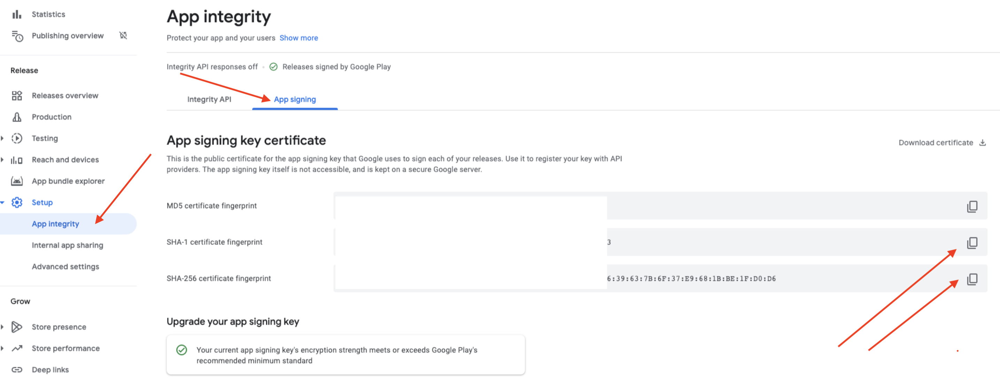
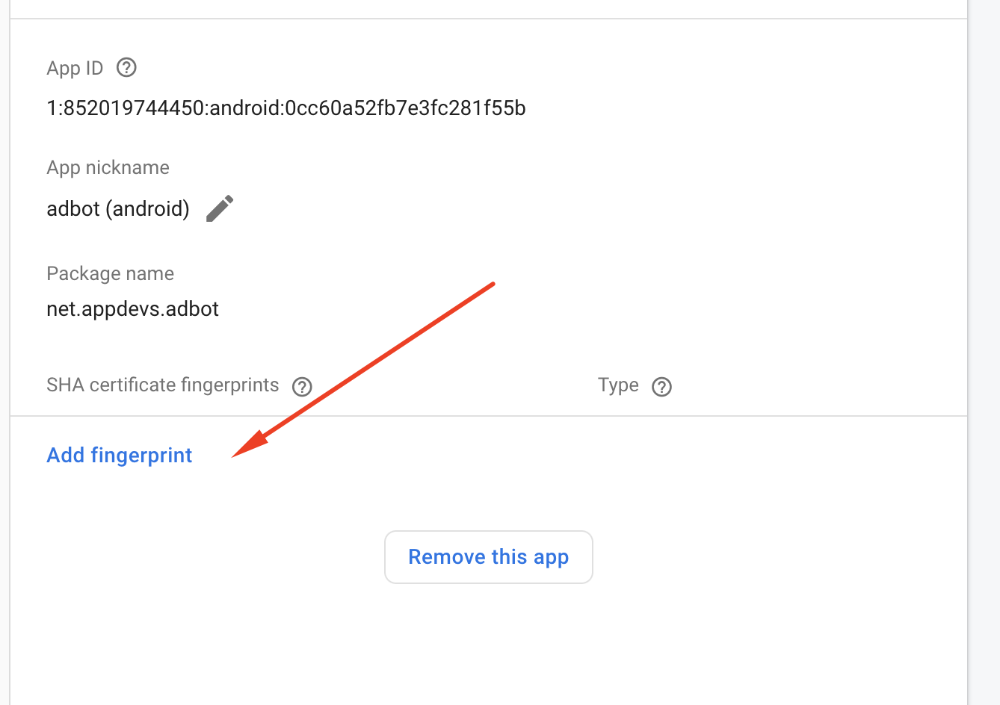
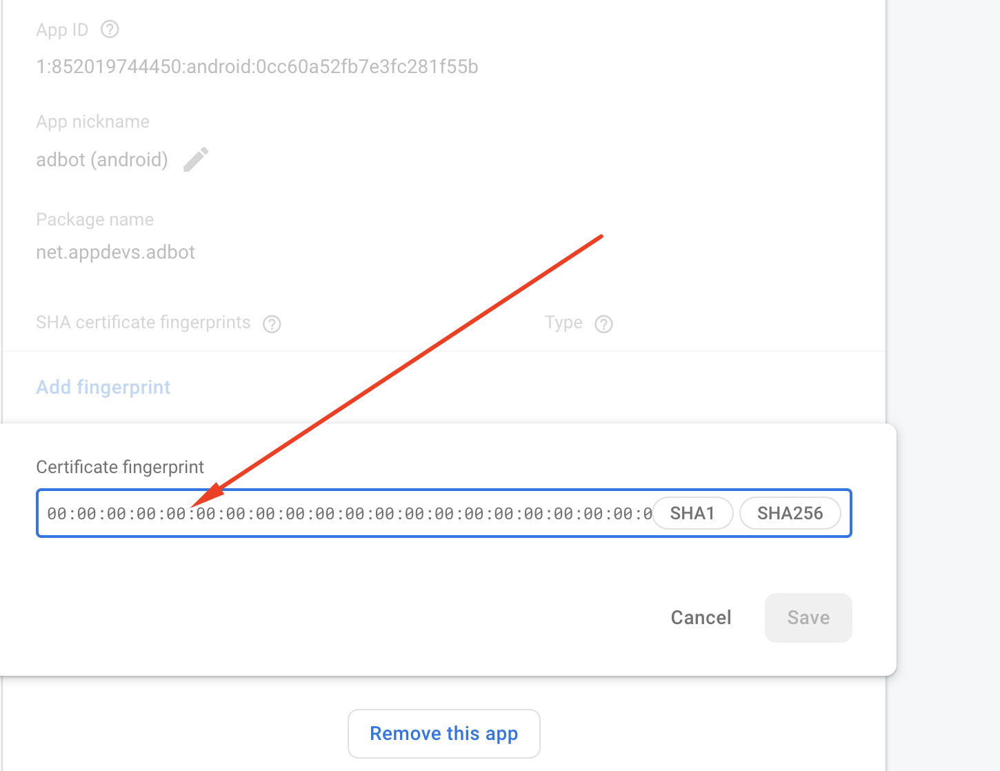

Release Android App:
--------------------------------

### Here is your section structure.

1. After you make all your changes and customizations save all your project, Open the console, navigate to your project folder and execute the following command to build your app:

`flutter build apk --release`

3. If you are deploying the app to the Play Store, it's recommended to use app bundles or split the APK to reduce the APK size.

### Build and Install App:

1. To generate an app bundle, run:

`flutter build appbundle --target-platform android-arm,android-arm64,android-x64`

Learn more on [https://developer.android.com/guide/app-bundle](https://developer.android.com/guide/app-bundle)4. To split the APKs per ABI, run:

`flutter build apk --target-platform android-arm,android-arm64,android-x64 --split-per-abi`

Learn more on [https://developer.android.com/studio/build/configure-apk-splits#confi](https://developer.android.com/studio/build/configure-apk-splits#confi)7. If you want to upload
your application on Google Play you must sign it before uploading, generate a signing key by running the following command:

`keytool -genkey -v -keystore android/app/key.jks -keyalg RSA -keysize 2048 -validity 10000 -alias key`

9. Reference the keystore from the app: Create a file named appdir/android/key.properties that contains a reference to your keystore:

```
storePassword=password from previous step
keyPassword=password from previous step
keyAlias=key
storeFile=location of the key store file, e.g. /Users/user name/key.jks
```

11. Go to android/app/build.gradle

```
def keystorePropertiesFile = rootProject.file("key.properties")   
def keystoreProperties = new Properties()   
keystoreProperties.load(new FileInputStream(keystorePropertiesFile))

signingConfigs {   
     release {   
       keyAlias keystoreProperties\['keyAlias'\]   
       keyPassword keystoreProperties\['keyPassword'\]   
       storeFile file(keystoreProperties\['storeFile'\])   
       storePassword keystoreProperties\['storePassword'\]   
     }   
   }
buildTypes {   
     release {   
      signingConfig signingConfigs.release   
     }   
   }
```

13. Learn More: [Build and release an Android app](https://docs.flutter.dev/deployment/android)
14. After approved android app on PlayStore, go to inside app console Setup>App Integrity>App Signing and copy SHA-1 certificate fingerprint & SHA-256 certificate fingerprint, then
    paste it on firebase project and click on Save button
    [](images/android-1.png)[ ](images/android-2.png)[](images/android-3.png)
