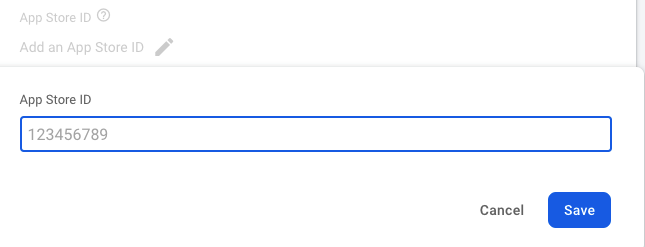

Release iOS App:
----------------------------

#### Before you can build and release your app on the App Store, you need to set up a place for it using App Store Connect. But first, you need to register a unique bundle ID for your app. This can be done by logging into your Apple Developer account and following these steps:

1.  Login to AppStore Conscole Account [Click Here](https://appstoreconnect.apple.com/login)
2.  Open the App IDs page.
3.  Click + to create a new Bundle ID.
4.  Fill out the needed information: App Name, and Explicit App ID.
5.  If your app needs specific services, select them and click Continue.
6.  Review the details and click Register to finish.
7.  Then go to account dashboard Select My Apps.
8.  Click + then select New App.
9.  Fill in your app details and make sure iOS is selected, then click Create.
10.  From the sidebar, select App Information.
11.  In the General Information section, select the Bundle ID that you registered above.
     **You’ve set everything up from Apple’s side, and next you’ll adjust your Xcode project’s settings to prepare your app for release. Go ahead and fire up Xcode.**13.  Open Runner.xcworkspace that is inside your app’s iOS folder.
14.  From the Xcode project navigator, select the Runner project.
15.  Go to the General tab.
16.  In the Identity section, fill out the information and make sure the Bundle Identifier is the one registered on App Store Connect.
17.  In the Signing section, make sure Automatically manage signing is checked and select your team
18.  Fill out the rest of the information as needed.
19.  Next, you’ll update your app’s icon. This can be done by selecting Assets.xcassets in the Runner folder from Xcode’s project navigator.
     **At this point, all the settings have been updated for release and there is a placeholder ready on App Store Connect, which means you can build and release.**21.  From the command line, run flutter build ios
22.  Then go back to Xcode and reopen Runner.xcworkspace
23.  Select Product -> Scheme -> Runner
24.  Select Product -> Destination -> Generic iOS Device.
25.  Select Product -> Archive to produce a build archive.
26.  From the Xcode Organizer window, select your iOS app from the sidebar, then select the build archive you just produced.
27.  Click the Validate… button to build.
28.  Once the archive is successfully validated, click Upload to App Store
     **Back on App Store Connect, check the status of your build from the Activities tab. Once it’s ready to release:**30.  Go to Pricing and Availability and fill out the required information.
31.  From the sidebar, select the status.
32.  Select Prepare for Submission and complete all required fields.
33.  Click Submit for Review
34.  Learn More: [Build and release an iOS app](https://docs.flutter.dev/deployment/ios)
     **That’s it! Your app will now be uploaded to the App Store. Apple will review your app before releasing and keep you updated on the status of your app.**36.  After uploading ios app on AppStore, go to inside app console App Information>Apple ID and copy, then paste it on firebase project
     
